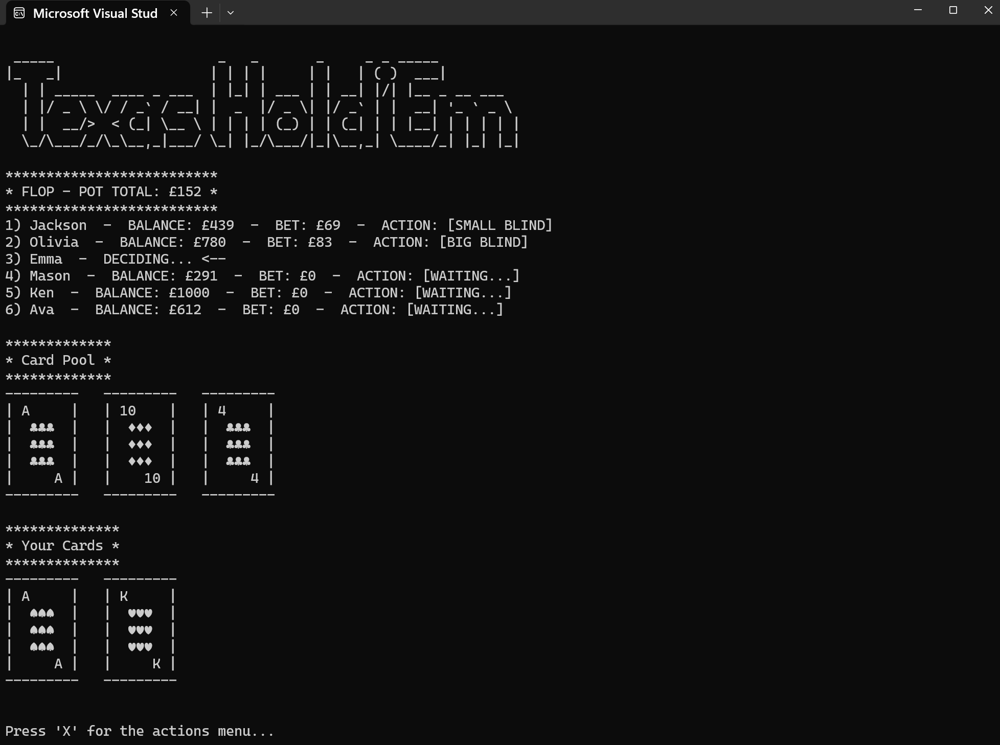

# TexasHoldEmCPP

- ### Game stats persist after closing the program (stored in a local `.txt` file)
	- ### Name
	- ### Rank
	- ### ELO
	- ### Total balance
	- ### Win/loss record
	- ### Total amount of games played
	- ### Leaderboard
	- ### Settings

- ### Opponent's will play better, the higher the rank of the game (E.g. Will have a higher probability of bluffing when in favoured positions, higher probability of recognizing the optimal card combination, etc...)

- ### Ranks based on ELO (Easiest to Most Difficult)
	- ### Iron (Min bet >= 1)
	- ### Bronze (Min bet >= 100)
	- ### Silver (Min bet >= 1000)
	- ### Gold (Min bet >= 10,000)
	- ### Platinum (Min bet >= 100,000)
	- ### Diamond (Min bet >= 500,000)
	- ### Master (Min bet >= 1,000,000)
	- ### Challenger (Min bet >= 2,000,000)

- ### If Total balance is ever < minimum bet (Min bet) for a rank,
	- ### Player rank goes to a rank they can bet at

- ### If Total balance ever reaches <= 0
	- ### Game stats reset back to default values, as if a new game

- ### Adding more features as i go...